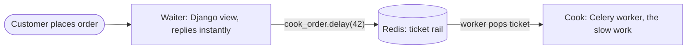
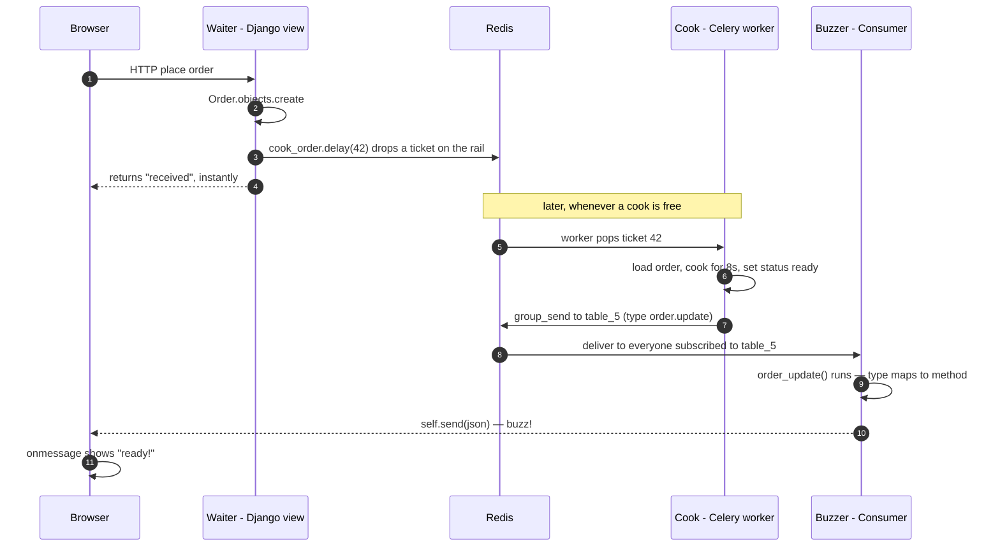

A friend was looking over my shoulder while I worked on a Django project that leans hard on
Celery and WebSockets. He's a sharp guy, and genuinely into programming — he's picked up the basics
of functional and object-oriented programming, and with a lot of help from AI coding agents he's
built himself a tidy little website for his restaurant and even a small internal CMS to run the place.
So he can *read* code. But the things he's built are CRUD-shaped — forms, pages, a database — not
distributed systems. After a few minutes of scrolling he turned to me with the exact face I've made
at other people's code a hundred times.

> "Hold on. This function — `cook_order` — where does it actually get called? I see it *defined*
> here, but the thing that runs it is in a completely different file. And these `consumer` things,
> they're off in another folder. And what is this — `order_update`? Why is there an underscore where
> everything else uses a dot? How the hell is any of this connected?"

He'd put his finger on the exact thing that makes async Django feel like black magic the first time
you meet it: **the pieces don't call each other the way normal code does.** You can't just
"follow the function." The waiter takes your order in one file; the food gets cooked in another; and
somehow a notification appears on a screen from a third. Nothing seems to *call* anything.

So I closed the laptop and explained it the only way I knew he'd get instantly — using his own
restaurant. It worked so well I'm writing it down.

This post is that explanation, end to end: **how Django, Redis, Celery, and Django Channels fit
together**, why the code is "scattered" on purpose, and what that underscore is really doing. By the
end you should be able to open a project like this and know exactly where to look.

## The one idea you have to accept first

Here's the thing that unlocks everything else, and it's the thing my friend was missing:

> **Your app is not one program. It's several separate programs running at the same time, and they
> cannot call each other's functions.**

In a normal script, function A calls function B, B returns, done. You can read it top to bottom.
But the moment you add Celery and WebSockets, you've got **two or three independent programs**, each
running in its own process, each with its own memory. Program A literally *cannot* reach into
program B and run a function there — any more than the waiter can reach into the kitchen and
personally fry the fish.

So how do separate programs get anything done together? They **leave messages for each other in a
shared place.** In our case, that shared place is **Redis**. Hold onto that — it's the secret to the
whole thing, and we'll come back to it twice.

Let me build the restaurant up one role at a time.

## The waiter: a web server only wants to be fast

A web server does one thing in a loop: a request comes in, it produces a response, it sends it back,
next. That's it. In Django, that's your view.

The waiter is the same. A customer orders; the waiter writes it down and... well, what *should* he do
next? Here's the trap. Imagine the waiter personally cooked every dish before taking the next table's
order. Service would collapse. One slow risotto and the entire dining room sits there, menus closed,
waiting.

A web request has exactly this problem. Some work is **fast** (save a row, return a page). Some work
is **slow** — charging a card, calling a third-party API over the internet, resizing a video,
crunching a report. If your view does the slow work *inline*, two bad things happen:

1. **The user waits.** The page hangs for seconds.
2. **Everyone else waits too.** That worker process is busy and can't serve other requests.

So the rule, carved into stone:

> **Never do slow work inside a web request. Answer fast, do the slow stuff somewhere else.**

The waiter doesn't cook. He writes a ticket. Which brings us to the kitchen.

## The kitchen: Celery is the cook, Redis is the ticket rail

Watch what a real kitchen does. The waiter scribbles your order on a **ticket** and spikes it on the
**rail** above the pass. Then he immediately walks off to the next table. Behind the line, the
**cooks** pull tickets off the rail whenever they're free, and they cook.

That's the whole pattern. Three roles:

| Restaurant | Django world | What it *literally* is |
|---|---|---|
| The waiter | your Django view | the `web` process handling requests |
| The ticket rail | the Celery **broker** | a list living in **Redis** |
| Writing a ticket and spiking it | `cook_order.delay(order.id)` | "append a JSON note to that Redis list" |
| The cook pulling tickets | the Celery **worker** | a *separate* process: `celery -A app worker` |

Let me show you the code, because this is exactly where my friend got lost. Here's the waiter — a
plain Django view that takes an order:

```python
# orders/views.py  — THE WAITER
from django.http import JsonResponse
from .models import Order
from .tasks import cook_order

def place_order(request):
    order = Order.objects.create(table=request.POST["table"],
                                 item=request.POST["item"])

    # Spike the ticket on the rail. This does NOT cook anything.
    cook_order.delay(order.id)

    # Walk away immediately. The customer gets an answer in milliseconds.
    return JsonResponse({"order_id": order.id, "status": "received"})
```

And here's the cook — defined in a totally different file, `tasks.py`:

```python
# orders/tasks.py  — THE COOK
import time
from celery import shared_task
from .models import Order

@shared_task
def cook_order(order_id):
    order = Order.objects.get(pk=order_id)
    time.sleep(8)            # the slow part: actually cooking the dish
    order.status = "ready"
    order.save()
```

Now — my friend's first question. *"Where is `cook_order` called?"*

Look carefully. The view says `cook_order.delay(order.id)`. That `.delay()` is the trick, and it is
**not** what it looks like. It does **not** run `cook_order`. What it actually does is:

1. Take a tiny note — `{"task": "cook_order", "args": [42]}` — and **push it onto a list in Redis.**
2. Return *instantly.* The waiter has walked away. The customer already has their "order received."

The function `cook_order` doesn't run here at all. It runs later, **in a different program**: the
Celery worker. That worker is a separate process you start yourself (`celery -A app worker`). All it
does, all day, is sit in a loop staring at the Redis list going *"any tickets? any tickets?"* When
your note shows up, it pops it off, sees the name `cook_order`, and **runs that function in its own
process.**

> This is why you can't "follow the function." The waiter and the cook are different people in
> different rooms. The only thing connecting `views.py` to `tasks.py` is a note passed through Redis.
> `.delay()` is the hand-off, not a function call.

### Why send the id and not the whole order?

Notice we passed `order.id` — the number `42` — not the `order` object. My friend caught this too.
The answer is pure restaurant: **the ticket says "Table 5, dish #42," not the entire recipe and a
basket of ingredients.** The note has to be small and simple to travel through Redis. The cook
re-reads the full, current details from the database (`Order.objects.get(pk=42)`) when he's ready.
Shipping the whole fat object across the boundary would be wasteful, and it might be stale by the
time the cook gets to it anyway. Pass a reference; let the worker fetch the truth.

### "So does Django *manage* the cook?"

No — and this surprised him most. **Django and the Celery worker are two separate programs that
don't know about each other.** They only share two things:

- **The same codebase**, so the worker can find and run `cook_order`.
- **The same Redis**, so the note the view dropped is the note the worker picks up.

If you killed the worker, your Django site would keep running perfectly. `.delay()` would still
succeed — tickets would just pile up on the rail, uncooked, until a worker came back. That's the
entire relationship. "Django handling Celery" is really just "Django dropping notes in a Redis list
that another program happens to be reading."

Here's the picture so far:



Two separate programs. One shared rail. No direct calls.

## The reverse problem: how does the customer learn the food is ready?

So the cook finishes. The dish is up. Now we want to tell the customer **without them having to walk
back to the counter and ask.** This is where most people's mental model breaks, because of something
about the web that's easy to forget:

> **A normal web request is one-shot. The server answers once, and then the conversation is over.
> The server has no way to speak to the browser again later.**

It's like exchanging letters. You send one, you get one back, and the mailbox closes. Once the waiter
delivered "order received," he has *no line back to you.* If you want to know whether your food is
ready, you — the browser — have to walk up and ask again. And again. (That repeated asking is called
**polling**, and it works, but it's the customer pestering the counter every ten seconds.)

We want something better: we want the kitchen to **buzz** you the instant your order's up. For that
you need a connection that **stays open** so the server can speak whenever it wants. That open
connection is a **WebSocket** — think of it as the **pager/buzzer** the restaurant hands you. You
hold it; whenever your order is ready, *they* light it up. You never had to ask.

Two consequences fall out of this, and they explain a lot of the "why is this set up so weirdly":

**1. Ordinary Django can't hold buzzers open.** The classic Django setup (WSGI) is built for letters:
handle a request, forget you, move on. To hold thousands of open connections at once you need a
different kind of server — an **ASGI** server, like **Daphne** or **Uvicorn**. **Django Channels** is
the library that teaches Django to speak WebSocket on top of ASGI. That's all Channels is: the
buzzer system bolted onto Django.

**2. The thing that handles your open buzzer is called a *consumer*.** It's the WebSocket equivalent
of a view. Here's ours — and yes, it lives in *yet another file*, `consumers.py`:

```python
# orders/consumers.py  — THE BUZZER IN THE CUSTOMER'S HAND
import json
from channels.generic.websocket import AsyncWebsocketConsumer

class OrderConsumer(AsyncWebsocketConsumer):
    async def connect(self):
        # Which table's buzzer is this? From the URL, e.g. /ws/table/5/
        self.table = self.scope["url_route"]["kwargs"]["table"]
        self.group = f"table_{self.table}"

        # Subscribe THIS buzzer to its table's group, then accept the connection.
        await self.channel_layer.group_add(self.group, self.channel_name)
        await self.accept()

    async def disconnect(self, code):
        # Customer left / closed the tab — hand the buzzer back.
        await self.channel_layer.group_discard(self.group, self.channel_name)

    async def order_update(self, event):     # ← the mysterious underscore. Hang on.
        # Buzz! Push the news down the open socket to the browser.
        await self.send(text_data=json.dumps(event))
```

On the browser side, the customer picks up their buzzer like this:

```javascript
// table 5's page opens a buzzer line and waits
const ws = new WebSocket("ws://localhost:8000/ws/table/5/");

ws.onmessage = (e) => {
  const data = JSON.parse(e.data);
  document.querySelector("#status").textContent = data.status;  // "ready!"
};
```

The connection is wired up in routing, much like `urls.py` but for sockets:

```python
# orders/routing.py
from django.urls import path
from .consumers import OrderConsumer

websocket_urlpatterns = [
    path("ws/table/<int:table>/", OrderConsumer.as_asgi()),
]
```

So now every seated customer is holding an open buzzer, subscribed to their table's group. But —
*who presses the button?* The cook finished the work and knows the news. The cook is in the kitchen.
The buzzers are out in the dining room, held open by a *different* program. The cook can't reach them.

Sound familiar?

## Redis, again: the pass that connects kitchen to floor

Watch the real kitchen one more time. When a dish is up, the cook doesn't sprint into the dining room
holding a plate and a pager remote. He calls it out at **the pass** — *"Order up, table five!"* — and
the expo/floor staff, who are watching the pass, buzz the right table.

That shared spot — the pass — is the second use of **Redis.** In Channels it's called the **channel
layer**, and a **group** is just a named buzzer list, like `"table_5"` — *everyone holding a buzzer
for table five.*

Here's the cook calling out at the pass. We add it to `cook_order`:

```python
# orders/tasks.py  — THE COOK, now calling "order up!" at the pass
from asgiref.sync import async_to_sync
from channels.layers import get_channel_layer

@shared_task
def cook_order(order_id):
    order = Order.objects.get(pk=order_id)
    time.sleep(8)
    order.status = "ready"
    order.save()

    channel_layer = get_channel_layer()
    async_to_sync(channel_layer.group_send)(
        f"table_{order.table}",                              # which buzzers (the group)
        {"type": "order.update", "status": "ready",          # what to do + the payload
         "order_id": order.id},
    )
```

And *now* I can finally answer my friend's last question — the underscore.

### The underscore: `"order.update"` → `order_update`

Look at what `group_send` sends: a dict with `"type": "order.update"`. And look back at the consumer:
it has a method called `order_update`. **These are the same thing.** Here is the rule, and it's the
single most important convention in all of Channels:

> When a group message arrives at a consumer, **Channels takes the `type`, replaces the dots with
> underscores, and calls the method of that name.** `"order.update"` → `order_update()`.

That's the whole trick. You never see `order_update` get "called" anywhere, because *you* don't call
it — **Channels calls it for you, by name, based on the `type` string.** It's a switchboard. The
`type` is which button to press; Channels routes the message to the matching method; that method does
`self.send(...)` — which is the actual *buzz* down the WebSocket to the browser.

So the two words my friend mixed up are doing different jobs:

- **The group** (`"table_5"`) = *which buzzers* should go off.
- **The type** (`"order.update"` → `order_update`) = *which handler* on each consumer runs.

Once you see that, the "scattered" code stops being scattered. It's a relay, and every hop is
deliberate.

## The whole story, one order, every actor named

Let me put the entire flow in one picture. This is the thing to screenshot and pin above your desk.



Notice **Redis shows up twice** — once as the ticket rail (waiter → cook) and once as the pass
(cook → buzzer). That's the recurring move, and it's the answer to "how is any of this connected?":

> **Separate programs never call each other. They leave messages in Redis, and another program picks
> them up.**

## A note on the word "async" (it means two different things here)

This trips up everyone, so let me kill the confusion directly. You'll hear "async" twice in this
stack and they are *not* the same thing:

- **Celery async** = "do it *later*, in a *different process*." That's the cook. It's how slow work
  gets off the request.
- **ASGI / Channels async** = "handle *many open connections at once* in the *same* process." That's
  the floor staff juggling a hundred buzzers without dropping any. It's how WebSockets are even
  possible.

Two unrelated mechanisms that happen to share a buzzword. Don't let it knot your brain.

## Redis is wearing three hats

One more thing worth saying plainly, because it confused my friend (and confuses everyone): **Redis
is one program doing several unrelated jobs.** In a typical setup it's:

1. **The Celery broker** — the ticket rail (the job queue).
2. **The Channels layer** — the pass (live broadcast between processes).
3. **A cache** — a fast scratchpad for whatever else (sessions, rate limits, computed results).

These have nothing to do with each other. They're just three different *uses* of the same fast shared
store. So when you see "Redis" mentioned in three different settings blocks, don't assume they're
linked — they're three tenants in the same building.

## How to actually navigate a project like this

Here's the practical payoff — what I told my friend to do the next time he opens scary async Django.
Don't try to read it top to bottom. Instead, **find each actor and trace the handoffs**:

| You're looking for... | Open this | The tell |
|---|---|---|
| The waiter (fast path) | `views.py` | a normal view that ends in `.delay(...)` |
| The ticket hand-off | the `.delay()` call | this is where the request stops and a job begins |
| The cook (slow work) | `tasks.py` | functions decorated `@shared_task` / `@app.task` |
| The "order up!" call | inside the task | a `group_send(...)` near the end |
| The buzzer | `consumers.py` | a class extending `...WebsocketConsumer` |
| Which buzzers ring | the `group` string | `group_add` in `connect`, same string in `group_send` |
| Which handler runs | match `type` → method | `"a.b"` in `group_send` → `a_b()` in the consumer |
| The socket URL wiring | `routing.py` + `asgi.py` | `websocket_urlpatterns`, `ProtocolTypeRouter` |

And when something doesn't work, debug it as a relay — pick a hop and ask *"did the message make it
this far?"*

- **Job never runs?** Is the Celery worker even running? (`celery -A app worker`.) Tickets pile up on
  the rail with no cook. Check the worker logs.
- **Job runs but the browser never updates?** The cook cooked but the "order up" never reached the
  floor. Check the `group_send` fired, and that the `type` matches a consumer method name exactly.
- **Browser never connects at all?** That's the buzzer line itself — your ASGI server / routing, not
  Celery. Open the browser dev tools, Network tab, and watch the WS connection.

> Tip worth its weight: in Chrome/Firefox dev tools, the **Network → WS** tab shows you the open
> WebSocket and *every single frame* that comes down it. It's the single best way to see whether the
> buzzer is actually buzzing.

## The takeaway

My friend's confusion wasn't a skill gap — it was a mental-model gap. He was trying to read the code
like a single recipe, top to bottom, when it's actually **a kitchen**: separate people, doing
separate jobs, coordinating through a shared rail and a shared pass. Once that clicked, the
"scattered" files weren't scattered anymore. The waiter takes the order and writes a ticket. The cook
pulls tickets and cooks. When a dish is up, it's called out at the pass, and the right buzzer goes
off. And **Redis is the rail and the pass** — the neutral meeting point that lets programs who can't
talk directly still run a busy service together.

If you remember one sentence, make it this: **separate programs don't call each other — they leave
messages in Redis, and someone else picks them up.** Everything else in Celery and Channels is just
detail hanging off that idea.

The funniest part? By the end, the restaurant owner understood the architecture better than half the
backend candidates I've interviewed. Turns out he'd been running a distributed, event-driven system
with real-time notifications for fifteen years. He just called it "Friday night."
