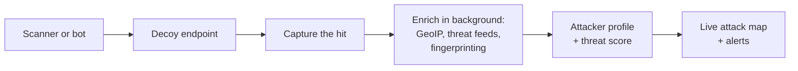

A while ago I read an article about honeypots and could not stop thinking about it. The idea is
simple, a little bit sneaky, and once it clicked I wanted one running on my own server.

This is the story of what a honeypot is, why I ended up building one for Django, and what it does.

## What a honeypot actually is

Put a server on the public internet and it starts getting scanned almost immediately. Not by people,
by bots. They sweep the whole internet looking for the same handful of mistakes: a leaked `.env`
file full of database passwords, a forgotten WordPress admin, an exposed `.git` folder, a phpMyAdmin
login someone left open. If they find one, they walk right in.

Most servers answer these probes with a 404 and move on. A honeypot does the opposite. It answers
the probe with a convincing fake, a `.env` file stuffed with realistic but useless credentials, or
an admin login page that goes nowhere. Then it quietly records everything about whoever knocked.

Here is the part I find beautiful. No real user has any reason to request `/.env` on your site. So
the moment someone does, you already know something about them. There is no guessing and there are
almost no false alarms. Every hit is a probe, and every probe tells you who is out there and what
they are hunting for.

## Why I built one

Once I wanted this, I went looking for a Django package. There are big standalone honeypot systems
you run as their own separate infrastructure, which is great if you want a dedicated trap server.
But I did not find anything you could just add to a Django project you already have, the way you add
any other app.

So I built it, and released it as **honeydj**. It is on PyPI now:

```bash
pip install honeydj
```

I spent about three weeks of evenings on it. I studied how the existing honeypots work, picked the
features that actually earn their place in a small self-hosted setup, and used Claude Code to move
quickly through the building. I reviewed every line that went in.

## What it does

honeydj is a four-stage pipeline. A probe comes in, gets trapped, gets recorded, gets enriched in
the background, and shows up on a live map.



Broken down, that is:

- **Decoy endpoints.** Fake `/.env`, fake `/wp-admin/`, a fake admin login, and more. You configure
  which paths to trap from the Django admin, live, no redeploy needed.
- **Capture with no slowdown.** A middleware traps the request before it ever reaches your real app.
  It does one quick database write and hands everything slow off to a background worker, so a bot
  hammering your server cannot bog it down.
- **Enrichment.** Each hit gets geolocated, checked against threat-reputation feeds like AbuseIPDB
  and VirusTotal, and fingerprinted to identify the actual scanning tool (sqlmap, nikto, and friends
  give themselves away even when they fake their user agent).
- **Attacker profiles.** Everything rolls up per IP address into a dossier with a threat score from
  0 to 100, so you see who an attacker is across all their attempts, not just one line in a log.
- **A live world map.** Enriched hits stream to a dashboard over WebSockets. When a probe geolocates,
  a marker pulses on the map in real time.
- **Canary tokens and alerts.** You can plant single-use trip-wire URLs inside bait files and get a
  Slack or webhook alert the moment one is opened.

## Try it, with one honest caveat

If this sounds fun, please try it. The [documentation](https://bistasulove.github.io/honeydj/) walks
through the whole setup.

Here is the caveat I want to be upfront about: this is not a one-line install. The live map needs
PostgreSQL, Redis, Celery, and an ASGI server, which is real infrastructure to stand up. I did not
want to hide that, so I built a `simulate_scanner` command that fires a full fake attack wave through
the entire pipeline. You can watch the whole thing work in about a minute, before you wait for a real
attacker to find you.

One more note. I built this with a lot of help from Claude Code. I designed the architecture and
reviewed everything that went in, but it is a young project at v0.2.0, so there are almost certainly
rough edges I have not hit yet. If you play with it and something breaks, an issue on the repo would
genuinely help me a lot.

## What is next

I already deployed honeydj into my own production app to test it for real, and the first attacker
showed up faster than I expected. I wrote up that whole integration, and the surprising first day of
traffic, in a [follow-up post](/writing/adding-a-honeypot-to-my-django-app).

I am going to let it run for a couple of weeks and then share the numbers. I have a feeling the
volume is going to surprise a few people. It already surprised me.

**Update:** the report is live. Here is [what twelve days of honeypot traffic actually looked
like](/writing/what-my-honeypot-caught-in-12-days).
